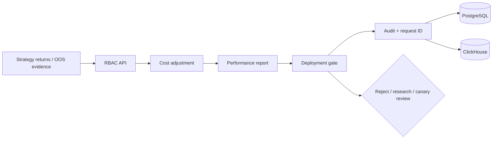

# Architecture — SYNERGY QuantLab

```mermaid
flowchart LR
A[Strategy returns / OOS evidence]-->B[RBAC API]
B-->C[Cost adjustment]
C-->D[Performance report]
D-->E[Deployment gate]
E-->F[Audit + request ID]
F-->G[(PostgreSQL)]
F-->H[(ClickHouse)]
E-->I{Reject / research / canary review}
```

Primary endpoint: `/enterprise/v1/validation/evaluate`. Validation results are evidence for deployment governance, not a profitability promise.